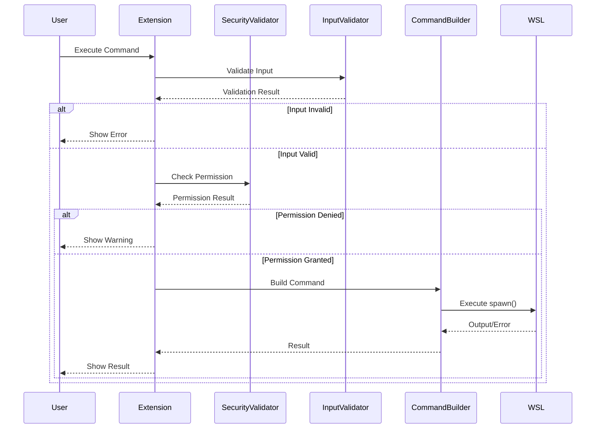
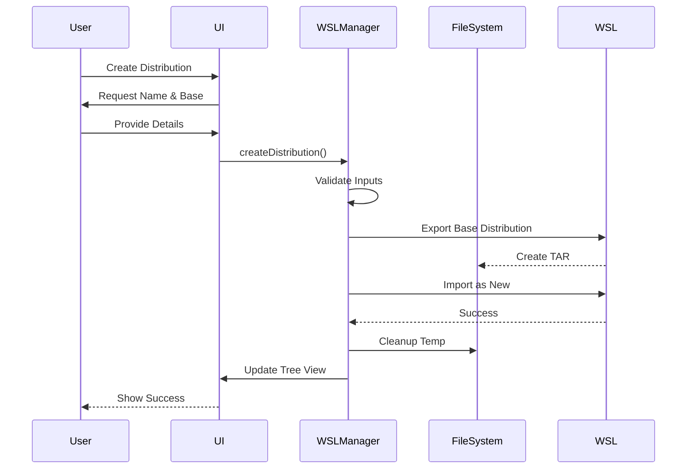

# VSC WSL Manager Architecture Overview

## Table of Contents
1. [System Architecture](#system-architecture)
2. [Component Overview](#component-overview)
3. [Data Flow](#data-flow)
4. [Security Architecture](#security-architecture)
5. [Extension Lifecycle](#extension-lifecycle)
6. [Design Patterns](#design-patterns)

## System Architecture

VSC WSL Manager follows a layered architecture pattern with clear separation of concerns:

```
┌─────────────────────────────────────────────────────────────┐
│                    VS Code Extension Host                    │
├─────────────────────────────────────────────────────────────┤
│                    Presentation Layer                        │
│  ┌─────────────┐  ┌──────────────┐  ┌──────────────────┐  │
│  │   Commands  │  │  Tree View   │  │ Terminal Profiles│  │
│  └─────────────┘  └──────────────┘  └──────────────────┘  │
├─────────────────────────────────────────────────────────────┤
│                     Business Logic Layer                     │
│  ┌─────────────┐  ┌──────────────┐  ┌──────────────────┐  │
│  │ WSLManager  │  │   Terminal   │  │     Security     │  │
│  │             │  │   Manager    │  │    Validator     │  │
│  └─────────────┘  └──────────────┘  └──────────────────┘  │
├─────────────────────────────────────────────────────────────┤
│                      Utility Layer                           │
│  ┌─────────────┐  ┌──────────────┐  ┌──────────────────┐  │
│  │  Command    │  │    Input     │  │     Error        │  │
│  │  Builder    │  │  Validator   │  │    Handler       │  │
│  └─────────────┘  └──────────────┘  └──────────────────┘  │
├─────────────────────────────────────────────────────────────┤
│                      System Layer                            │
│  ┌─────────────┐  ┌──────────────┐  ┌──────────────────┐  │
│  │   WSL.exe   │  │  File System │  │    VS Code API   │  │
│  └─────────────┘  └──────────────┘  └──────────────────┘  │
└─────────────────────────────────────────────────────────────┘
```

## Component Overview

### Core Components

#### 1. Extension Entry Point (`extension.ts`)
- **Responsibility**: Extension lifecycle management
- **Key Functions**:
  - Activates the extension
  - Registers commands with VS Code
  - Initializes all managers
  - Sets up event handlers
  - Handles deactivation cleanup

#### 2. WSL Manager (`wslManager.ts`)
- **Responsibility**: Core WSL operations
- **Key Functions**:
  - List distributions
  - Create/clone distributions
  - Import/export TAR files
  - Delete distributions
  - Execute commands in distributions
- **Security**: All operations are validated and rate-limited

#### 3. Tree Data Provider (`wslTreeDataProvider.ts`)
- **Responsibility**: VS Code tree view integration
- **Key Functions**:
  - Provides hierarchical distribution view
  - Updates tree on changes
  - Supplies icons and context values
  - Manages tree item states

#### 4. Terminal Profile Manager (`terminalProfileManager.ts`)
- **Responsibility**: Terminal integration
- **Key Functions**:
  - Creates terminal profiles for distributions
  - Updates VS Code settings
  - Manages profile lifecycle
  - Handles rollback on failures

### Security Components

#### 1. Command Builder (`utils/commandBuilder.ts`)
- **Responsibility**: Secure command execution
- **Key Features**:
  - Uses `spawn()` instead of `exec()`
  - Validates command arguments
  - Prevents injection attacks
  - Handles process lifecycle

#### 2. Input Validator (`utils/inputValidator.ts`)
- **Responsibility**: Input sanitization
- **Key Features**:
  - Validates distribution names
  - Checks file paths for traversal
  - Sanitizes command parameters
  - Provides detailed error messages

#### 3. Security Validator (`security/securityValidator.ts`)
- **Responsibility**: Access control and rate limiting
- **Key Features**:
  - Rate limiting per operation type
  - Command whitelisting
  - Permission checks
  - Audit logging
  - Suspicious pattern detection

### Support Components

#### 1. Error Handler (`errors/errorHandler.ts`)
- **Responsibility**: Error management
- **Key Features**:
  - Error classification
  - User-friendly messages
  - Recovery suggestions
  - Timeout handling

#### 2. Logger (`utils/logger.ts`)
- **Responsibility**: Logging and diagnostics
- **Key Features**:
  - Multiple log levels
  - File and console output
  - Performance metrics
  - Security event logging
  - Data sanitization

## Data Flow

### Command Execution Flow



### Distribution Creation Flow



## Security Architecture

### Defense in Depth

The extension implements multiple layers of security:

1. **Input Layer**
   - All user inputs are validated
   - Dangerous patterns are rejected
   - Path traversal is prevented

2. **Command Layer**
   - Commands are built with `spawn()`
   - Arguments are properly escaped
   - Command injection is prevented

3. **Access Layer**
   - Rate limiting prevents abuse
   - Destructive operations require confirmation
   - Audit logging tracks operations

4. **Error Layer**
   - Errors don't expose system details
   - Sensitive data is sanitized
   - Recovery options are provided

### Threat Model

| Threat | Mitigation |
|--------|------------|
| Command Injection | Use spawn() with argument arrays |
| Path Traversal | Validate and normalize all paths |
| Resource Exhaustion | Rate limiting per operation |
| Information Disclosure | Sanitize error messages and logs |
| Unauthorized Access | Permission prompts for destructive ops |

## Extension Lifecycle

### Activation

```typescript
activate(context: ExtensionContext) {
    // 1. Initialize core services
    const wslManager = new WSLManager();
    const terminalManager = new TerminalProfileManager(context);
    
    // 2. Create UI components
    const treeProvider = new WSLTreeDataProvider(wslManager);
    const treeView = createTreeView('wslDistributions', { treeDataProvider });
    
    // 3. Register commands
    registerCommands(context, wslManager, treeProvider);
    
    // 4. Set up event handlers
    setupEventHandlers(context, wslManager, terminalManager);
    
    // 5. Initial data load
    executeCommand('wsl-manager.refreshDistributions');
}
```

### Deactivation

```typescript
deactivate() {
    // 1. Save state if needed
    // 2. Cleanup resources
    // 3. VS Code handles subscription disposal
}
```

## Design Patterns

### 1. Singleton Pattern
Used for stateful services that should have only one instance:
- `SecurityValidator`
- `Logger`

```typescript
class SecurityValidator {
    private static instance: SecurityValidator;
    
    static getInstance(): SecurityValidator {
        if (!this.instance) {
            this.instance = new SecurityValidator();
        }
        return this.instance;
    }
}
```

### 2. Builder Pattern
Used for constructing complex commands safely:

```typescript
class CommandBuilder {
    static buildImportCommand(name: string, location: string, tar: string): string[] {
        return ['--import', name, location, tar];
    }
}
```

### 3. Factory Pattern
Used for creating tree items with consistent configuration:

```typescript
class WSLTreeItem extends TreeItem {
    static createDistributionItem(distro: WSLDistribution): WSLTreeItem {
        return new WSLTreeItem(
            distro.name,
            distro,
            TreeItemCollapsibleState.Collapsed
        );
    }
}
```

### 4. Observer Pattern
Used for tree view updates:

```typescript
class WSLTreeDataProvider implements TreeDataProvider<WSLTreeItem> {
    private _onDidChangeTreeData = new EventEmitter<WSLTreeItem | undefined | null | void>();
    readonly onDidChangeTreeData = this._onDidChangeTreeData.event;
    
    refresh(): void {
        this._onDidChangeTreeData.fire();
    }
}
```

### 5. Strategy Pattern
Used for different validation strategies:

```typescript
interface ValidationStrategy {
    validate(input: string): ValidationResult;
}

class DistributionNameValidator implements ValidationStrategy {
    validate(input: string): ValidationResult {
        // Implementation
    }
}
```

## Performance Considerations

### Optimization Strategies

1. **Lazy Loading**
   - Tree items are loaded on demand
   - Distribution details fetched when expanded

2. **Caching**
   - Rate limit states are cached in memory
   - Command history for pattern detection

3. **Async Operations**
   - All I/O operations are asynchronous
   - UI remains responsive during long operations

4. **Resource Management**
   - Temporary files are cleaned up immediately
   - Process handles are properly released
   - Event listeners are disposed on deactivation

### Performance Metrics

Key metrics tracked:
- Command execution time
- Distribution creation time
- Import/export duration
- Tree view refresh time

## Future Architecture Considerations

### Planned Enhancements

1. **Plugin System**
   - Allow third-party extensions
   - Custom distribution templates
   - Hook system for operations

2. **Remote WSL Support**
   - Manage WSL on remote machines
   - SSH integration

3. **Batch Operations**
   - Multiple distribution management
   - Bulk import/export

4. **Advanced Monitoring**
   - Resource usage tracking
   - Performance dashboards
   - Health checks

### Scalability Considerations

- Handle hundreds of distributions efficiently
- Optimize tree view for large lists
- Implement virtual scrolling if needed
- Consider pagination for operations

---

For more details, see:
- [Security Architecture](security.md)
- [Data Flow Documentation](data-flow.md)
- [API Documentation](../api/README.md)